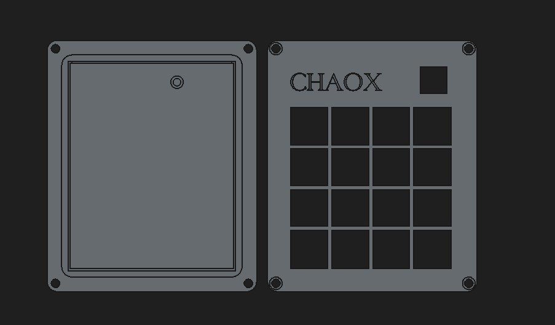
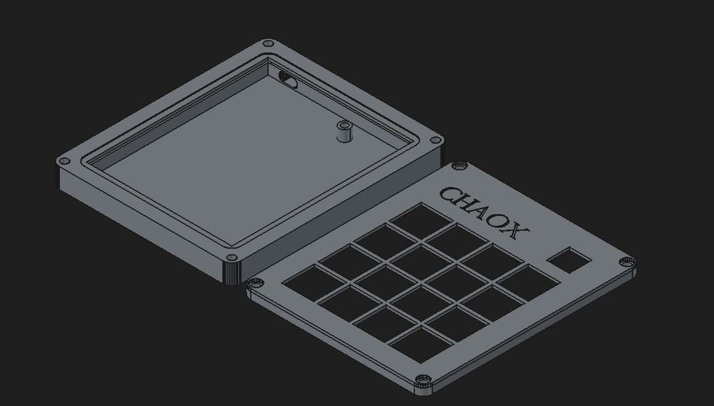
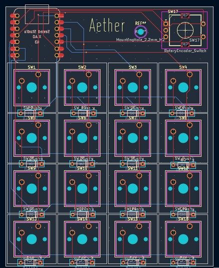
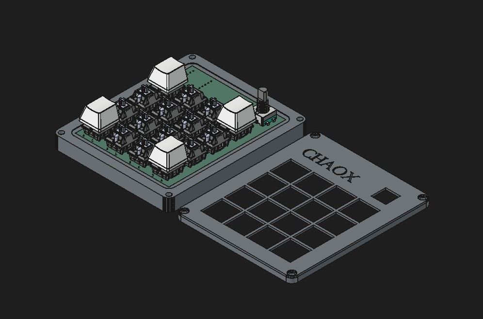

# CHAOX-Macropad
A macro-pad with 16 keys and a rotary encoder powered by Seeed XIAO RP2040

I wanted something that was actually useful on my desk, but also something I could completely customize so i made this from the PCB and firmware to the case.

## Things present in the chaox-pad

- 16 MX-style mechanical switches
- 1 EC11 rotary encoders
- Seeed XIAO RP2040
- 1N4148 diodes
- Custom PCB
- Custom 3D-printed case
- CHAOX engraved top plate

## The design

I designed this case in FreeCAD.

I kept the top plate removable, so the switches and electronics can be assembled more easily.

## PCB

I used Kicad 10 to make my PCB

The PCB files are in:

`PCB/`

## Firmware

The firmware is written using KMK and CircuitPython.

It currently includes:

- Multiple layers
- Keyboard shortcuts
- Text macros
- Numpad layer
- Rotary encoder controls
- Volume controls
- Tab switching
- Media controls

Firmware files are in:

`Firmware/`

## CAD files

All of the case files are available in:

`CAD/`

You can open the FreeCAD file if you want to modify the design yourself.

The STEP files are also included for anyone who wants to work with the case in another CAD program.

## BOM

- Seeed XIAO RP2040 -1
- Through-hole 1N4148 Diodes -16
- MX-Style switches -16
- EC11 Rotary encoders -1
- M3x16mm screws -4
- M3x5mx4mm headset inserts -4
- M2x3mm screw -1

## Why I made it

I wanted to build something but didn't know what to build so then i saw a reel of alex saying i made this hackpad and u can build it too so i got inspired and made this.

There will probably be things I change in the future, but this is the current version of the Chaox-Macropad
---

Made by **01HACKER01** 🖤
